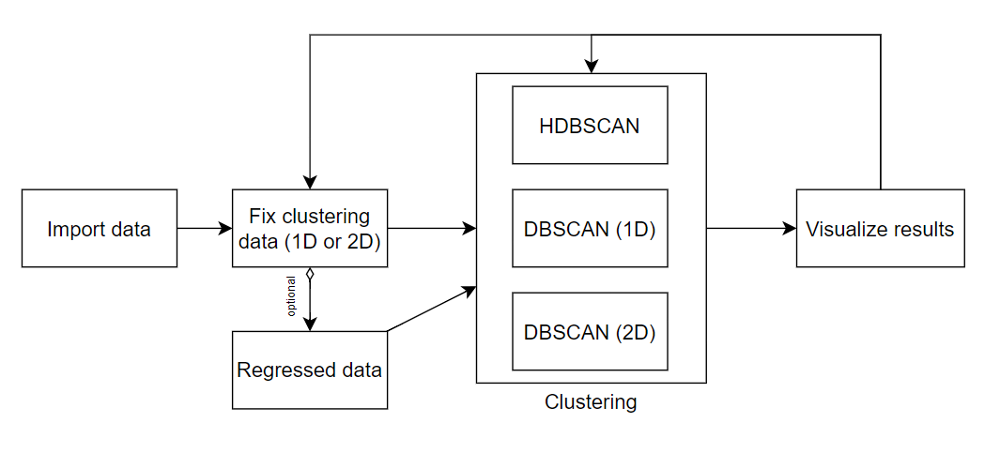

# Geophysical Clustering
[](https://drive.google.com/file/d/15w0umUMTyJEZ5WnLvaFFDIDJfp26iZfZ/view?usp=sharing)
[](https://www.linkedin.com/in/issam-souassi-74916114a/)
[](https://github.com/issamsouassi/Geophysical_Clustering.git)


  This project is part of my internship in the UMR6118 Géosciences-Rennes, it's about applying density-based clustering algorithms to geophysical data to characterize the study site's geological heterogeneity. The study site is in the town of Guidel, department of Morbihan, France.

### Description
  The project is done in the form of a jupyter notebook, it's made to manage geophysical data and apply DBSCAN (Density-Based Spatial Clustering of Applications with Noise) and HDBSCAN (Hierarchical Density-Based Spatial Clustering of Applications with Noise), and analyze the clusters on the assumption that the same cluster designs the same geological composition. 

  N.B: the project contains two geophysical sections.
  
  The choice of those algorithms is based on the scientific article _"A data mining approach for improved interpretation of ERT inverted sections using the DBSCAN clustering algorithm"_ [Sabor et _al_., 2021].

### How to use the notebook?

___


<p align="center"><strong>
Flowchart of data
</strong></p>

___

- The _**importing data**_ section is for importing and wrangling geophysical and wells data, then the original data is plotted to visualize its spatial distribution.

- The _**Regressed parameters**_ section is optional. In order to promote the detachment of vertical heterogeneities (faults), we calculate the trend of each parameter as a function of depth after subtracting the trend of each point to focus on the lateral variation. 

- The _**Clustering**_ section is the main section so far, in this section there are two cells for DBSCAN, and each of them is used for a different number of dimensions, and this is due to a memory issue in bidimensional clustering in Scikit-Learn library.

The clustering cells contain the parameters of clustering at the beginning of each cell :
```{python}
eps = 0.008
min_sample = 1000
```
The same for the clustering data :
```{python}
dataset_DB = ['mgl_norm']
```
- The _**plotting**_ section is automated to plot the results of the last executed cell of clustering, the clustering data and parameters are displayed automatically in the figure, also the two sections are plotted in the same figure and have the same color code of clusters.

- The final cell, _**Clustering distribution**_ is an automated cell to plot the distribution of clusters of the last clustering cell executed, if it's unidimensional it will be a _histplot_, and if it's bidimensional it will be a _scatterplot_.

